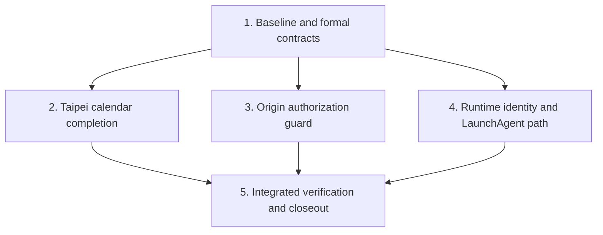

# DevDiary reliability and local-runtime security hardening blueprint

## 中文摘要

這份計畫把全專案稽核中最具使用者影響的問題收斂成一個 worktree：先保留並重新驗證既有的每日摘要與台北日期修正，再補齊日期分桶、安全來源檢查、Core 執行身分與 macOS 背景排程安裝路徑。所有執行都以本機安全測試資料進行，不讀寫使用者真正的 DevDiary 資料庫，也不做 merge、push、安裝或發佈。

## Objective

Deliver one reviewable branch in which DevDiary's date-scoped behavior is consistently Asia/Taipei, its loopback HTTP API rejects untrusted browser-origin requests before side effects, its runtime manifest requires a live owner process, and its packaged LaunchAgent assets live in a user-writable location.

## Starting evidence

- Primary worktree: clean `main` at `af1a21311eea49787d9beddbaa6d36bb29c22720`, equal to `origin/main` after a successful prune fetch.
- Working branch starts at `197bceb18f846c7196d076a4d3d8fb7a09233782`, whose parent chain contains `main` plus two isolated diary/date commits.
- Main baseline: Core 242/242 tests, Core typecheck, UI/API 72/72 tests, and Vite build pass.
- Working baseline inherited from the predecessor adds existing diary/date regression work, but all evidence must be rerun in this worktree.
- Confirmed defects:
  - session timestamps stored as UTC were grouped with raw string slicing while callers chose an Asia/Taipei date;
  - CORS hid responses from untrusted web pages but did not stop their mutation requests;
  - JS and Rust runtime-manifest readers trusted missing owner PIDs while the Core writer/reclaimer treated them as stale;
  - packaged LaunchAgent support files were derived beside `/Applications/DevDiary.app`, a location ordinary users generally cannot create.

## Root cause debugging record

### A. Calendar boundary mismatch

- Symptom: sessions between Taipei midnight and 08:00 can be absent from the requested Daily diary, Dashboard, Workspace, or export date.
- Reproduction: store `2026-06-30T17:30:00.000Z`, request `2026-07-01`, and compare a raw `substr(start_time,1,10)` predicate with an Asia/Taipei projection.
- Observed evidence: the server/scheduler choose `Asia/Taipei`, while multiple SQL readers and the historical token aggregate used the raw UTC date prefix.
- Root cause: one timestamp has two competing calendar interpretations and no single downstream execution contract.
- Fix boundary: shared Taipei projection helpers plus every date-scoped session reader/writer and UI default-date caller.
- Verification: boundary matrix across previous/current/next date, Dashboard, Workspace, scheduler inputs, daily export, and scan-derived token rows.
- Residual risk: existing derived `token_usage` rows may carry historical UTC dates; readers must not claim repaired historical semantics unless reconciled without destructive migration.

### B. Untrusted browser-origin mutation

- Symptom: an untrusted web page can submit a simple POST to the loopback Core; the browser cannot read the response, but the side effect executes.
- Reproduction: send an untrusted `Origin` to a mutation endpoint backed by an in-memory DB/provider spy and observe pre-fix invocation.
- Observed evidence: middleware only sets allowlisted CORS response headers and always calls `next()` for non-OPTIONS requests.
- Root cause: response-read policy was mistaken for request authorization.
- Fix boundary: an early Origin policy middleware before JSON parsing, provider calls, DB writes, or mutation routes.
- Verification: untrusted and opaque origins return 403 with zero downstream calls; trusted Tauri/dev origins and absent Origin retain expected behavior.
- Residual risk: no-Origin callers remain trusted because local native/CLI consumers depend on them; host binding and runtime identity remain separate controls.

### C. Runtime-manifest identity disagreement

- Symptom: clients can dial a stale or unrelated loopback service when a manifest lacks an owner PID.
- Reproduction: feed the same missing-PID manifest to the Core reclaimer, JS resolver, and Rust resolver and compare decisions.
- Observed evidence: the Core reclaimer rejects the record, while JS/Rust tests intentionally preserve backward compatibility.
- Root cause: duplicated trust logic drifted across three consumers.
- Fix boundary: require a positive live PID in both client resolvers and align their tests with the Core contract.
- Verification: live, dead, missing, zero, malformed, wrong-service, and non-loopback matrices.
- Residual risk: clients still have the documented legacy fixed-port fallback when no valid manifest exists.

### D. Packaged LaunchAgent write location

- Symptom: background runner setup can silently fail for a standard drag-installed app.
- Reproduction: resolve the packaged core path and observe the generated storage directory `/Applications/.DevDiaryLaunchAgents`.
- Observed evidence: setup writes launcher/plist files there and logs failure without surfacing it in the UI.
- Root cause: a packaged-app special case chose the app bundle's parent rather than the established per-user app data directory.
- Fix boundary: always generate support assets below Application Support; keep `~/Library/LaunchAgents` as the per-user registration point.
- Verification: pure path tests and Rust unit tests; no real LaunchAgent bootstrap in this task.
- Residual risk: full installed-app lifecycle remains a separate packaging/installation proof layer.

## Test depth route

- Level: 4 — core authorization boundary plus cross-module date/runtime contracts.
- Required verification: test-first bug-pattern matrix, Core/UI/Rust suites, integration tests proving the derived contracts execute, safe localhost API smoke, desktop UI check, independent black-box QA, security review, strict OpenSpec validation, build/type/diff review.
- Runtime smoke: REQUIRED against an in-memory/local test runtime with mock providers.
- Black-box QA: REQUIRED through a different read-only no-fork agent after Owner smoke.
- Allowed skips: no real user database, provider token spend, packaged installation, LaunchAgent bootstrap, notarization, merge, push, or deploy.

## Security review route

1. Threat model: protect app-owned local data, provider execution budget, and user trust at the browser-to-loopback-Core boundary.
2. Finding discovery: trace the `Origin` header through middleware to all mutation sinks; verify runtime-manifest identity and generated file paths as adjacent trust controls.
3. Validation: in-memory integration tests plus safe local API smoke; no private data.
4. Attack path/severity: victim visits a malicious page while DevDiary Core is running; the page can submit local requests, causing integrity loss or expensive local work without reading the response.
5. Escalation: OpenSpec O3 with the standard data/facts, naming/types, blast-radius, execution-order, and logic/design lenses plus the trigger-mapped security and authorization lenses; inconclusive review fails closed.

## Dependency graph



Steps 2–4 are conceptually independent, but they share specification and verification files. The single Owner executes them serially in one worktree to avoid overlapping writers and contract drift.

## Step 1 — Freeze baseline and author the O3 contract

### Context brief

The branch already contains two committed diary/date fixes not yet in `main`. Before changing executable code, preserve their exact revision, rerun their tests, scaffold one new O3 OpenSpec Change for the remaining hardening, and write the Level 4 test plan. The current Feature Spec is authoritative; archived Changes are evidence only.

### Tasks

1. Confirm `main` is an ancestor, branch status is clean, and no secret-like files are trackable.
2. Rerun Core, UI/API, typecheck, build, and Rust baseline checks in the worktree.
3. Scaffold `harden-local-runtime-boundaries` at O3.
4. Author Proposal, Delta Spec, Design, Tasks, and the `doc/test` bug-pattern matrix.
5. Run strict OpenSpec validation and Author Preflight.
6. Run the O3 initial review with all five standard contract lenses plus security and authorization; apply one consolidated Owner fix, then obtain one fresh Sol closer over the same complete lens set.
7. Only after that exact reviewed contract converges, the Owner implements `scripts/verification-candidate-digest.sh` and `scripts/smoke-local-runtime.mjs` as repository-owned verification tools. Add `scripts/test-verification-candidate-digest.sh` against temporary Git repositories and `scripts/smoke-local-runtime.test.mjs` against an in-memory server so deterministic hashing, argument validation, cleanup, success, and failure exits are executable contracts rather than plan-only commands.

### Verification

```bash
git status --short --branch
npm test
npm run build
npm --prefix core test
npm --prefix core run typecheck
cargo test --manifest-path src-tauri/Cargo.toml
bash scripts/test-verification-candidate-digest.sh
node --test scripts/smoke-local-runtime.test.mjs
openspec validate harden-local-runtime-boundaries --strict --no-interactive
python3 ~/.codex/skills/openspec/scripts/spec_author_preflight.py --project-root . --change harden-local-runtime-boundaries --require-receipt
```

### Exit criteria

- Baseline failures are explained before implementation.
- O3 artifacts contain no unresolved clarification markers.
- Independent review covers all five standard lenses plus both mandatory security/authorization lenses and accepts the exact artifact revision.

### Rollback

Delete only the uncommitted active Change and plan/test documents through an explicit patch if authoring is abandoned; never alter archived evidence or reset user work.

## Step 2 — Complete the Asia/Taipei calendar contract

### Context brief

The predecessor branch introduced `taipeiDate` and a SQLite projection helper. This step verifies every current reader/writer uses the contract, closes gaps, and keeps historical data claims honest without a destructive database migration.

### Tasks

1. Add failing date-boundary tests for timestamps immediately before/at/after Taipei midnight.
2. Audit every `start_time` date/hour projection and every `token_usage.date` writer/reader.
3. Use one safe internal SQL projection helper for date/hour grouping; accept only `^[A-Za-z_][A-Za-z0-9_]*(?:\.[A-Za-z_][A-Za-z0-9_]*)*$` and reject leading digits, consecutive/trailing dots or SQL fragments before preparation.
4. Ensure the UI's default daily export date uses the same calendar helper.
5. Keep complete `Z`-suffixed session timestamps in detailed/audit exports as UTC facts while their date selection/grouping and separate labels remain Taipei.
6. Decide explicitly how historical derived token rows are read; prefer session source-of-truth calculations or an idempotent non-destructive reconciliation.
7. Update OpenSpec/task checkboxes only after tests pass.

### Verification

```bash
npm --prefix core test -- --run test/dashboard.test.ts test/projects.test.ts test/dailyScheduler.test.ts test/exports.test.ts test/scans.test.ts
npm test
npm --prefix core run typecheck
```

### Exit criteria

- Dashboard, Workspace, scheduler material, export, and scan-derived totals agree for the boundary matrix.
- No raw UTC-prefix grouping remains on user-visible Taipei-day paths unless documented as intentionally UTC.

### Rollback

Revert the calendar helper consumers as one logical patch; no persistent user data is migrated by this step.

## Step 3 — Enforce browser-origin authorization before mutation

### Context brief

Core is loopback-only but reachable from any browser page on the machine. CORS prevents response reading, not request execution. The correct narrow control is to reject any request carrying a non-allowlisted browser Origin before the route can parse or mutate, while preserving the desktop/dev origins and no-Origin native callers.

### Tasks

1. Add failing integration tests for untrusted `https://...`, `null`, and untrusted localhost origins on representative simple and JSON mutations.
2. Add hostile-Origin GET/OPTIONS, trusted OPTIONS, and no-Origin CLI GET/mutation/OPTIONS cases. Extract a pure middleware `next` seam, then combine malformed JSON, injected provider, DB before/after, and all-21-mutation-route evidence so parser/dispatch/effects are independently observable.
3. Implement an explicit trusted-origin decision and stable 403 error envelope. The packaged origin is exactly `tauri://localhost`; default dev origins are exactly `http://localhost:5173` and `http://127.0.0.1:5173`.
4. Add a validated dev-only exact-origin input for worktrees. Split/trim transport whitespace, reject empty tokens, validate origin-only `http` loopback URLs with an explicit bounded port and no credentials, path, query, fragment, wildcard, or non-loopback host, then reject duplicate additional origins and collisions with built-ins. Runtime smoke supplies exactly `http://localhost:5180,http://127.0.0.1:5180`; production does not gain a localhost-port wildcard.
5. Keep trusted Tauri/default-dev/worktree preflight and mutations working.
6. Keep no-Origin local callers working and document this deliberate boundary; reject `Sec-Fetch-Site: cross-site` even if an Origin is absent.
7. Review all methods and ensure the middleware applies centrally before `express.json()` and every route.

### Verification

```bash
npm --prefix core test -- --run test/runtimeHealth.test.ts test/dailyScheduler.test.ts test/scans.test.ts test/settings.test.ts
npm --prefix core run typecheck
```

### Exit criteria

- Every Origin-bearing untrusted request stops before mutation.
- Trusted and non-browser local callers retain current behavior.
- Security review records the remaining no-Origin and host-binding assumptions.

### Rollback

Remove the single middleware change and its tests as one patch; no database migration is involved.

## Step 4 — Align runtime identity and use per-user LaunchAgent assets

### Context brief

Runtime manifests are security-relevant routing hints. Missing PIDs must be treated consistently. Background support files are generated state and belong below the per-user Application Support directory, not beside an app in `/Applications`.

### Tasks

1. Flip the JS missing-PID regression test from trust to reject, then implement.
2. Add Rust missing/zero/dead/live PID tests, then align the resolver.
3. Make the runtime object canonical in JS/Rust, reject mismatched optional top-level URLs and out-of-range ports, and validate configured fallback ports before using them.
4. Replace the packaged special storage path with the existing per-user app-data `LaunchAgents` path and one per-user registration link.
5. Add Rust path/order tests for drag-installed and development core paths; lint the source plist before registration replacement and limit failure cleanup to the link created by the current attempt.
6. Preserve fixed-port fallback behavior when no valid manifest exists.
7. Do not bootstrap or remove any real LaunchAgent.

### Verification

```bash
npm test -- --test-name-pattern='manifest'
cargo test --manifest-path src-tauri/Cargo.toml
```

### Exit criteria

- JS, Rust, and Core lifecycle agree on manifest validity.
- Generated packaged support paths are user-writable by construction.
- No real user LaunchAgent or app installation is changed.

### Rollback

Revert the resolver and path-selection functions with their tests. Existing installed files are outside this task and remain untouched.

## Step 5 — Integrated verification, reconciliation, and commit

### Context brief

Static/unit success is insufficient for a changed local API authorization boundary. The Owner must run a safe actual runtime, then a different agent must independently test observable behavior. UI changes require a fresh desktop-only screenshot. Every artifact is bound to a deterministic candidate digest before commit and to the final commit SHA after commit; prior runtime/UI/QA output is invalid after either changes. OpenSpec is archived only after implementation and exact-revision evidence agree.

### Tasks

1. Run preliminary automated/runtime/UI/QA/security discovery evidence. Consume every finding, then mark tasks, sync/archive OpenSpec, reconcile current Feature Spec/`MASTER.md`, and complete every delivery-file edit. Preliminary evidence is never candidate proof.
2. Only after reconciliation, compute `candidate_revision` with `scripts/verification-candidate-digest.sh`; it hashes `HEAD`, tracked diff content, and every non-ignored untracked file path/content in stable byte order. The digest has no repository-local evidence-output exception: all files that can affect delivery are covered. Create `/tmp/devdiary-reliability-security-hardening/$candidate_revision/` for receipts and rerun all required gates. Any later delivery-file edit discards those receipts and restarts reconciliation/freeze.
3. Run `node scripts/smoke-local-runtime.mjs --revision "$candidate_revision" --output "/tmp/devdiary-reliability-security-hardening/$candidate_revision/smoke.json"`. The script starts an in-process Express server on dynamic loopback with `:memory:` SQLite, mock provider/spies, explicit worktree origins `5180`, and boundary fixtures; it closes the server/DB in `finally` and fails non-zero on any mismatch.
4. Start UI with `npm run dev -- --host localhost --port 5180`. Use the supported 1280x820 desktop viewport, save `/tmp/devdiary-reliability-security-hardening/$candidate_revision/ui-desktop.png` (optionally mirror it to the ignored `.codex/screenshots` path), and write the manifest beside it containing candidate revision, URL, viewport, capture tool, screenshot SHA-256, and change-marker mtime. Obtain the host-injected UI receipt in the same external directory; a self-authored manifest alone is not a pass.
5. Delegate independent black-box QA with exact write allowlist `/tmp/devdiary-reliability-security-hardening/$candidate_revision/qa-report.md`. The packet supplies the candidate revision, smoke URL/launcher, acceptance scenarios, safe fixture, and forbidden actions; the report records revision, timestamp, commands, results, screenshot/API evidence, and residual risk.
6. Run a fresh security/authorization closer on the candidate diff and store its receipt under `/tmp/devdiary-reliability-security-hardening/$candidate_revision/`, bound to the same candidate revision and Contract Matrix digest.
7. Assert the candidate digest is unchanged after all candidate gates; no task/spec/MASTER or other delivery file may be edited at this point.
8. Stage only the verified repository allowlist and create one conventional commit. Let `final_revision="$(git rev-parse HEAD)"`, create `/tmp/devdiary-reliability-security-hardening/$final_revision/`, and rerun automated gates, smoke JSON, UI capture/host receipt, independent black-box QA, and security closer into that external directory. Each receipt names the target `final_revision`; no provisional/candidate-bound runtime evidence is reused and no post-commit evidence is written into tracked or non-ignored repository paths, so the verified branch can remain clean.

### Verification

```bash
npm test
npm run build
npm --prefix core test
npm --prefix core run typecheck
cargo test --manifest-path src-tauri/Cargo.toml
bash scripts/test-verification-candidate-digest.sh
node --test scripts/smoke-local-runtime.test.mjs
candidate_revision="$(bash scripts/verification-candidate-digest.sh)"
evidence_dir="/tmp/devdiary-reliability-security-hardening/$candidate_revision"
mkdir -p "$evidence_dir"
node scripts/smoke-local-runtime.mjs --revision "$candidate_revision" --output "$evidence_dir/smoke.json"
npm run dev -- --host localhost --port 5180
openspec validate --specs --strict --no-interactive
python3 ~/.codex/skills/openspec/scripts/spec_author_preflight.py --project-root . --all-current
git diff --check
git status --short --branch
```

### Exit criteria

- The external smoke JSON, UI evidence/host receipt, QA report, and security receipt under the exact revision directory all contain the same current candidate digest or final commit SHA and fresh artifact digests.
- Level 4 route is satisfied with fresh Owner smoke and independent QA on the final commit SHA.
- Final diff contains no secrets, unplanned files, debug logging, or unresolved spec tasks.
- The branch is committed and clean; primary `main` remains untouched and clean.
- Repository-owned digest/smoke scripts pass their deterministic self-tests; evidence output never creates a second commit or changes the revision it claims to verify.
- Merge, push, deploy, installation, and publication remain pending separate authority.

### Rollback

Before commit, use targeted `apply_patch` reversals only. After commit, a later authorized integrator can use a normal revert commit; never rewrite shared history.

## Anti-patterns explicitly prohibited

- Treating CORS response headers as authorization.
- Checking Origin after a route has already mutated or invoked a provider.
- Fixing only one `substr(start_time,1,10)` occurrence while leaving downstream aggregates inconsistent.
- Trusting a runtime manifest because its port is loopback when process ownership is unknown.
- Writing generated background assets beside `/Applications` or silently testing against real user state.
- Reusing prior runtime/UI/independent-QA evidence as final proof.
- Broad staging, force-deleting branches, merging, pushing, installing, or publishing without separate authority.

## Plan mutation protocol

- Split: add a numbered substep when a proven failure has a different root cause or verification route.
- Insert: document new prerequisites before the dependent step and update the dependency graph.
- Reorder: allowed only when file ownership and spec/test dependencies remain valid.
- Skip: record a concrete reason and residual risk; required Level 4 gates cannot be silently skipped.
- Abandon: preserve user work, leave a clean branch if possible, and report the exact blocker without deleting evidence.
